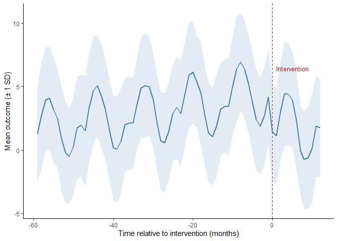
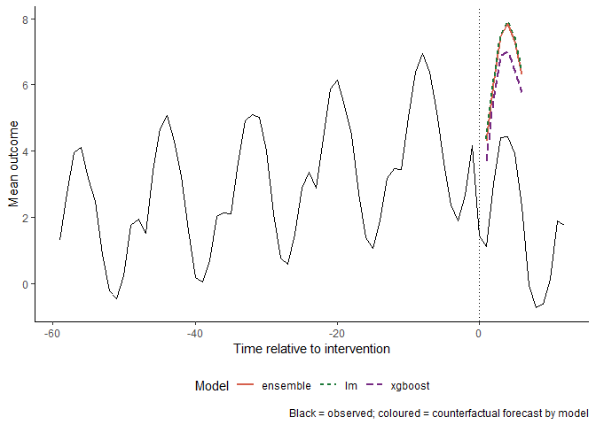
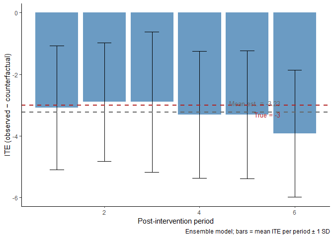

<!-- README.md is generated from README.qmd. Please edit that file -->

# itscausal

<!-- badges: start -->

<!-- badges: end -->

`itscausal` estimates the causal effect of a policy intervention on a
panel of units observed over time — an **interrupted time series (ITS)**
design.

The key idea: train ML models on the **pre-intervention** window to
predict each unit’s counterfactual outcome (what would have happened
without treatment). The individual treatment effect (ITE) is the
difference between observed and counterfactual outcomes:

$$\text{ITE}_{it} = y_{it} - \hat{y}_{it}^{(0)}, \quad t > 0$$

## Installation

``` r
# install.packages("devtools")
devtools::install_github("ASallin/itscausal")
```

## Workflow

``` r
devtools::load_all(quiet = TRUE)
library(data.table)
library(ggplot2)

set.seed(20240101)
```

### 1. Simulate a panel

60 individuals × 72 months; intervention at month 60; true level-shift =
**−3**.

``` r
n_id        <- 60
n_time      <- 72
INDEX       <- 60L
true_effect <- -3

ar1 <- function(n, phi = 0.6, sigma = 1) {
  e <- rnorm(n, 0, sigma); x <- numeric(n); x[1] <- e[1]
  for (t in 2:n) x[t] <- phi * x[t - 1] + e[t]; x
}

X     <- sample(c(0, 1), n_id, replace = TRUE)
id_fx <- rnorm(n_id, 0, 3)

df <- data.table(
  ID    = rep(seq_len(n_id), each = n_time),
  time  = rep(seq_len(n_time), n_id),
  X     = rep(X, each = n_time),
  id_fx = rep(id_fx, each = n_time)
)

season_coefs <- c(0, 1.5, 2.8, 3.1, 2.4, 1.2, -0.5, -1.8, -2.1, -1.4, 0, 0.3)
df[, month  := ((time - 1) %% 12) + 1]
df[, year   := ((time - 1) %/% 12) + 1]
df[, season := season_coefs[month]]
df[, error  := unlist(replicate(n_id, ar1(n_time, phi = 0.5, sigma = 1.5),
                                simplify = FALSE))]
df[, post   := as.integer(time >= INDEX)]
df[, y      := 2 + 0.05 * time + 0.8 * X + season + id_fx +
               true_effect * post + error]
```

<div id="fig-rawdata">



Figure 1

</div>

### 2. Forecast the counterfactual — comparing models

`forecastITS()` trains an ensemble of ML models on each cross-validation
fold and forecasts the post-intervention counterfactual. Here we compare
three specifications: linear model only, XGBoost only, and the ensemble
of both.

``` r
fore_lm <- forecastITS(
  data            = copy(df),
  time            = "time",
  key             = "ID",
  y               = "y",
  INDEX           = INDEX,
  WINDOW          = 12L,
  STEPS           = 6L,
  covariates_time = c("month", "year"),
  covariates_fix  = "X",
  method          = c("lm"),
  K               = 5L
)

fore_xgb <- forecastITS(
  data            = copy(df),
  time            = "time",
  key             = "ID",
  y               = "y",
  INDEX           = INDEX,
  WINDOW          = 12L,
  STEPS           = 6L,
  covariates_time = c("month", "year"),
  covariates_fix  = "X",
  method          = c("xgboost"),
  K               = 5L
)

fore_ens <- forecastITS(
  data            = copy(df),
  time            = "time",
  key             = "ID",
  y               = "y",
  INDEX           = INDEX,
  WINDOW          = 12L,
  STEPS           = 6L,
  covariates_time = c("month", "year"),
  covariates_fix  = "X",
  method          = c("lm", "xgboost"),
  K               = 5L
)

# Ensemble RMSE weights
round(fore_ens$RMSEweights, 3)
#>      lm xgboost 
#>       1       0
```

<div id="fig-forecast">



Figure 2

</div>

### 3. Individual & average treatment effects

``` r
ite_lm  <- iteITS(fore_lm)
ite_xgb <- iteITS(fore_xgb)
ite_ens <- iteITS(fore_ens)

n_post <- max(ite_ens$ites$time)

summarise_tate <- function(fore, ite, label) {
  ate <- ateITS(fore, ite, n.periods = n_post)
  data.frame(
    Model = label,
    TATE = round(ate$TATE$pred$ite, 3),
    SD = round(ate$TATE$sd$sd, 3)
  )
}

results <- rbind(
  summarise_tate(fore_lm,  ite_lm,  "lm"),
  summarise_tate(fore_xgb, ite_xgb, "xgboost"),
  summarise_tate(fore_ens, ite_ens, "ensemble")
)
results$lower <- round(results$TATE - 1.96 * results$SD, 3)
results$upper <- round(results$TATE + 1.96 * results$SD, 3)
results
#>      Model   TATE    SD  lower  upper
#> 1       lm -3.315 0.615 -4.520 -2.110
#> 2  xgboost -2.560 0.680 -3.893 -1.227
#> 3 ensemble -3.234 0.599 -4.408 -2.060
```

<div id="fig-ite">



Figure 3

</div>
