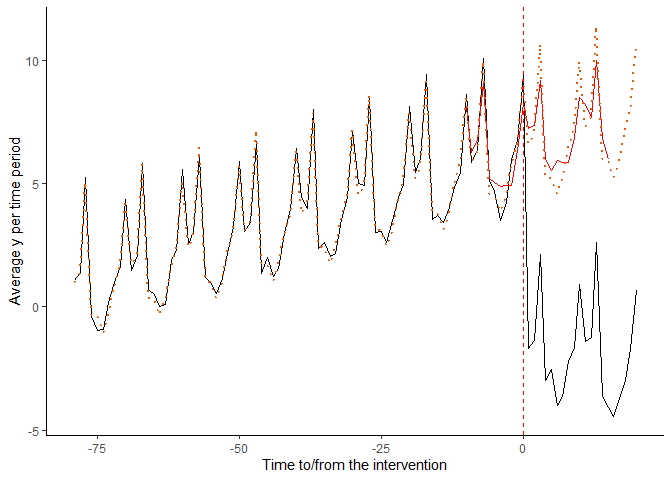
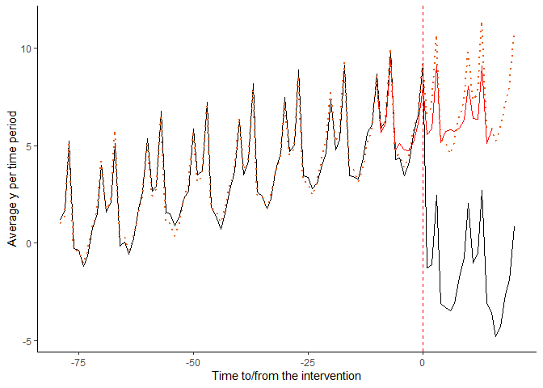
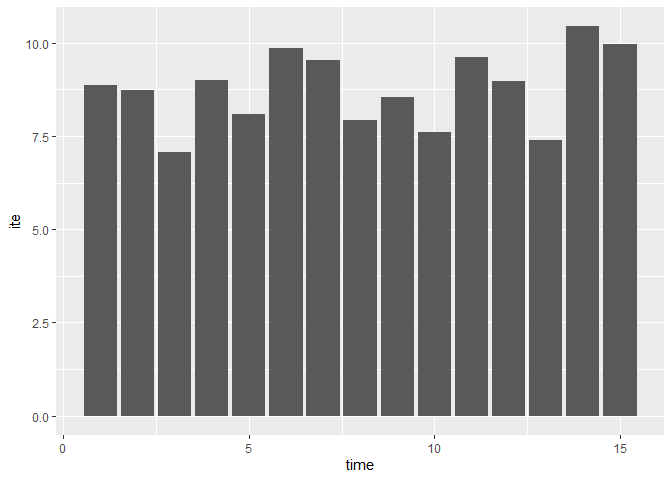

<!-- README.md is generated from README.Rmd. Please edit that file -->

# itscausal

<!-- badges: start -->
<!-- badges: end -->

Welcome to the package page of itscausal. The goal of itscausal is to
flexibly estimate interrupted time series With causal machine learning.

## Installation

You can install the development version of itscausal from
[GitHub](https://github.com/) with:

``` r
# install.packages("devtools")
devtools::install_github("ASallin/itscausal", force = TRUE)
```

## Example

This is a basic example which shows you how to solve a common problem:

``` r
library(itscausal)
library(data.table)
library(dplyr)
library(ggplot2)

set.seed(234493)


ar_process <- function(n, phi = 0.7, sigma = 1) {
  e <- rnorm(n, 0, sigma)
  x <- numeric(n)
  x[1] <- e[1]
  for (t in 2:n) {
    x[t] <- phi * x[t - 1] + e[t]
  }
  return(x)
}

arma_process <- function(n, ar = 0.7, ma = 0.3, sigma = 1) {
  e <- rnorm(n, 0, sigma)
  x <- numeric(n)
  x[1] <- e[1]
  for (t in 2:n) {
    x[t] <- ar * x[t - 1] + e[t] + ma * e[t - 1]
  }
  return(x)
}

heteroskedastic_errors <- function(n, base_sigma = 1, increase_rate = 0.1) {
  sigma <- base_sigma + increase_rate * (1:n)
  return(rnorm(n, 0, sigma))
}

set.seed(23493)

# Generate simulated dataset
n_time <- 100 # Number of time points
intervention <- round(0.8 * n_time) # Time point of intervention
n_id <- 60 # Number of unique individuals
constant <- 1

X <- sample(c(0, 1), n_id, T)
param_timetrend <- 0.07
param_dummyintervention <- -0.15
param_slopeintervention <- -0.10

# Seasonality
season_effect <- c(
  0,
  rnorm(2, 0, 4),
  rnorm(4, -2, 0.5),
  rnorm(3, 0, 1)
)

# Simulate an ITS
df <- data.frame(
  ID = rep(seq(1:n_id), each = n_time),
  X = rep(X, each = n_time),
  season = rep(
    c(rep(1:12, n_time %/% 12), (1:12)[1:(n_time %% 12)]),
    n_id
  ),
  id.effect = rep(rnorm(n_id, 0, 10), each = n_time),
  season_effect = rep(season_effect, times = n_time),
  post = rep(c(rep(0, intervention), rep(1, 0.2 * n_time)), n_id),
  time = rep((1:n_time) - intervention, n_id),
  error_simple = rnorm(n_time * n_id, 0, 2),
  error_ar = unlist(replicate(n_id, ar_process(n_time, sigma = 2), simplify = FALSE)),
  error_arma = unlist(replicate(n_id, arma_process(n_time), simplify = FALSE)),
  error_heteroskedastic = unlist(replicate(n_id, heteroskedastic_errors(n_time), simplify = FALSE))
)

df$abs_time <- df$time + abs(min(df$time))

# Generate y with different error structures
df$y_simple <- with(
  df,
  constant + param_timetrend * abs_time
    + (param_dummyintervention * post)
    + param_slopeintervention * post * abs_time
    + 0.2 * X
    + season_effect
    + error_simple
)

df$y_ar <- with(
  df,
  constant + param_timetrend * abs_time
    + (param_dummyintervention * post)
    + param_slopeintervention * post * abs_time
    + 0.2 * X
    + season_effect
    + error_ar
)

df$y_arma <- with(
  df,
  constant + param_timetrend * abs_time
    + (param_dummyintervention * post)
    + param_slopeintervention * post * abs_time
    + 0.2 * X
    + season_effect
    + error_arma
)

df$y_heteroskedastic <- with(
  df,
  constant + param_timetrend * abs_time
    + (param_dummyintervention * post)
    + param_slopeintervention * post * abs_time
    + 0.2 * X
    + season_effect
    + error_heteroskedastic
)

df <- data.table(df)


# Simulate y with seasonal effects
df <- df[
  , `:=`(
    model = constant
    + param_timetrend * (abs_time)
      + season_effect
      + 0.2 * X,
    forecast = constant
    + param_timetrend * abs_time
      + param_dummyintervention * post
      + param_slopeintervention * abs_time * post
      + season_effect
      + 0.2 * X
      + 0.03 * X * param_slopeintervention
  )
]
```

    #> `summarise()` has grouped output by 'time'. You can override using the
    #> `.groups` argument.
    #> Warning: Using `size` aesthetic for lines was deprecated in ggplot2 3.4.0.
    #> ℹ Please use `linewidth` instead.
    #> This warning is displayed once every 8 hours.
    #> Call `lifecycle::last_lifecycle_warnings()` to see where this warning was
    #> generated.


We can visualize the its as follows:

``` r
# Compute effects
df <- df[, ite := ifelse(post == 0, NA, model - forecast)]
ate5 <- mean(df[time < 6 & post == 1, ]$ite)
ate1 <- mean(df[time < 2 & post == 1, ]$ite)

print(ate5)
#> [1] 8.3518
print(ate1)
#> [1] 8.1518
```

We can reproduce these results using the `itscausal` package.

``` r
window <- 36L

fore_y_simple <- forecastITS(
  data = df,
  time = "time",
  INDEX = 0L,
  WINDOW = window,
  STEPS = 5,
  covariates_time = c("season"),
  covariates_fix = c("X"),
  key = "ID",
  y = "y_simple",
  method = c("lm", "xgboost"),
  K = 5
)
#> Df has 99time periods.
#> The intervention happens at period 0 (index). 
#> The fit will be tested on 5 periods (steps) before the intervention.
#> The time window to train the models has36 periods (window).
#> The prediction space for forecasting is20 periods.
#> 1...
#> 2...
#> 3...
#> 4...
#> 5...

fore_y_ar <- forecastITS(
  data = df,
  time = "time",
  INDEX = 0L,
  WINDOW = window,
  STEPS = 5,
  covariates_time = c("season"),
  covariates_fix = c("X"),
  key = "ID",
  y = "y_ar",
  method = c("lm", "xgboost"),
  K = 5
)
#> Df has 99time periods.
#> The intervention happens at period 0 (index). 
#> The fit will be tested on 5 periods (steps) before the intervention.
#> The time window to train the models has36 periods (window).
#> The prediction space for forecasting is20 periods.
#> 1...
#> 2...
#> 3...
#> 4...
#> 5...

fore_y_arma <- forecastITS(
  data = df,
  time = "time",
  INDEX = 0L,
  WINDOW = window,
  STEPS = 5,
  covariates_time = c("season"),
  covariates_fix = c("X"),
  key = "ID",
  y = "y_arma",
  method = c("lm", "xgboost"),
  K = 5
)
#> Df has 99time periods.
#> The intervention happens at period 0 (index). 
#> The fit will be tested on 5 periods (steps) before the intervention.
#> The time window to train the models has36 periods (window).
#> The prediction space for forecasting is20 periods.
#> 1...
#> 2...
#> 3...
#> 4...
#> 5...

fore_y_heteroskedastic <- forecastITS(
  data = df,
  time = "time",
  INDEX = 0L,
  WINDOW = window,
  STEPS = 5,
  covariates_time = c("season"),
  covariates_fix = c("X"),
  key = "ID",
  y = "y_heteroskedastic",
  method = c("lm", "xgboost"),
  K = 5
)
#> Df has 99time periods.
#> The intervention happens at period 0 (index). 
#> The fit will be tested on 5 periods (steps) before the intervention.
#> The time window to train the models has36 periods (window).
#> The prediction space for forecasting is20 periods.
#> 1...
#> 2...
#> 3...
#> 4...
#> 5...

dfFinal_simple <- fore_y_simple$out
dfFinal_ar <- fore_y_ar$out
dfFinal_arma <- fore_y_arma$out
dfFinal_heteroskedastic <- fore_y_heteroskedastic$out
```

    #> Joining with `by = join_by(ID, time)`
    #> Warning: Removed 74 rows containing missing values or values outside the scale range
    #> (`geom_line()`).



    #> Joining with `by = join_by(ID, time)`
    #> Warning: Removed 74 rows containing missing values or values outside the scale range
    #> (`geom_line()`).



    #> Joining with `by = join_by(ID, time)`
    #> Warning: Removed 74 rows containing missing values or values outside the scale range
    #> (`geom_line()`).


    #> Joining with `by = join_by(ID, time)`
    #> Warning: Removed 74 rows containing missing values or values outside the scale range
    #> (`geom_line()`).


## Compute the instantaneous treatment effect for the whole population

``` r
iteM <- iteITS(forecast.object = fore_y_simple)

InstAte <- ateITS(fore_y_simple, ite.object = iteM)
InstATE <- InstAte$InstATE

ggplot(InstATE$pred, aes(x = time, y = ite)) +
  geom_bar(stat = "identity")
```



## Per groupdf

``` r
ate1its <- ateITS(fore_y_simple, iteM, n.periods = 1)
paste("mean = ", round(ate1its$TATE$pred$ite, 3), "; sd = ", round(ate1its$TATE$sd$sd, 3))
#> [1] "mean =  8.868 ; sd =  0.225"

ate5its <- ateITS(fore_y_simple, iteM, n.periods = 5)
paste("mean = ", round(ate5its$TATE$pred$ite, 3), "; sd = ", round(ate5its$TATE$sd$sd, 3))
#> [1] "mean =  8.353 ; sd =  0.757"

ate1
#> [1] 8.1518
ate5
#> [1] 8.3518
```
